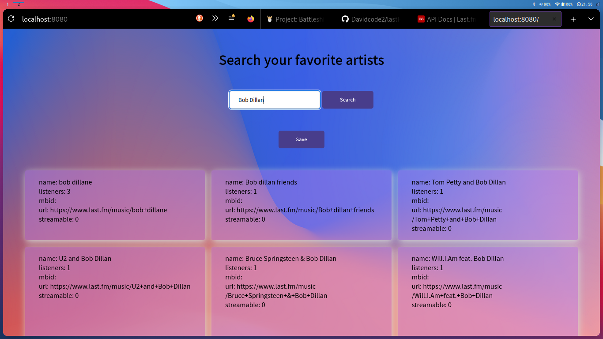

# artist search and csv file save

Showcase project for Incedo

## dependencies

install typescript compiler

```bash
npm install typescript
```

install packages in both frontend and backend

```bash
cd backend
npm install
```

```bash
cd frontend
npm install
```

## build

in both frontend and backend, run 

```bash
npm run build
```

## run

run start script

```
bash ./start.sh
```

A browser window should open with the program running on port 8080.

# Screenshot



# notes

Not all the requirements were met:
- if the search returns no result, no behavior is implemented.
- the image column does not have a header
- in case of special artist names the alignment in the csv file is off.
- The path to which the csv file should be saved can not be specified.

It took me longer than the estimated time to complete this project (around 8 hours).
Nonetheless I've learned a lot and most importantly had a lot of fun creating it.
